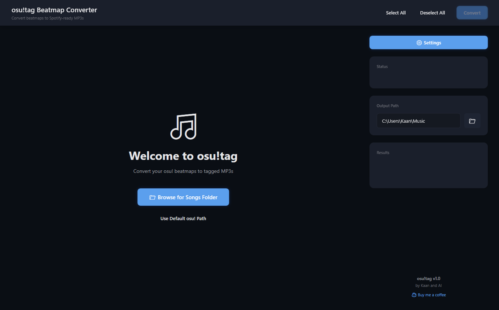
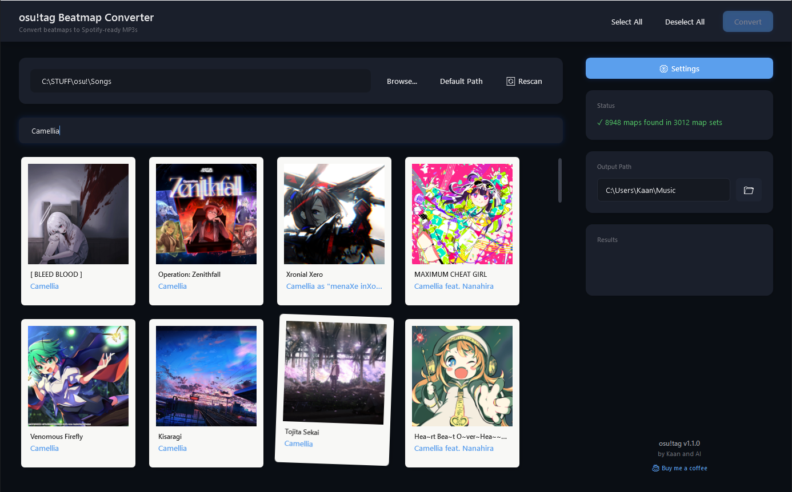
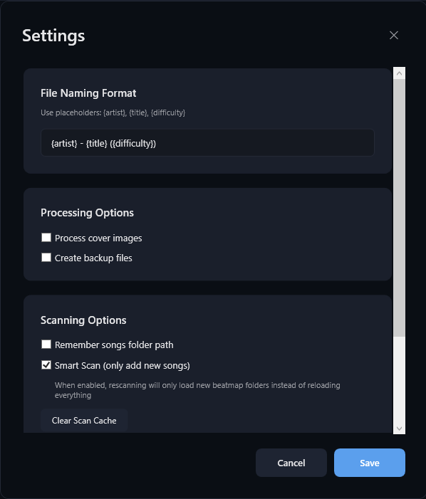
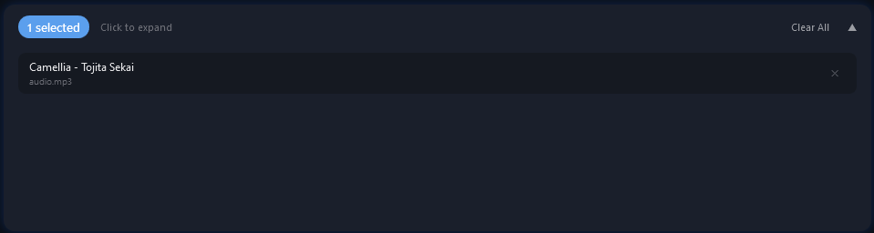

# osu!tag

<p align="center">
  
</p>

<p align="center">
  <strong>Convert your osu! beatmaps into properly tagged MP3 files</strong>
</p>

<p align="center">
  <a href="#features">Features</a> •
  <a href="#installation">Installation</a> •
  <a href="#usage">Usage</a> •
  <a href="#screenshots">Screenshots</a> •
  <a href="#license">License</a>
</p>

---

## Features

- 🎵 **Batch Convert** - Convert multiple beatmaps to tagged MP3s at once
- 🏷️ **Auto-Tagging** - Automatically applies ID3 tags (Artist, Title, Album Art)
- 🖼️ **Cover Art** - Extracts and embeds beatmap backgrounds as album covers
- 🔍 **Smart Scan** - Only scans new beatmap folders on subsequent launches
- 🎧 **Audio Preview** - Hover over maps to preview the audio
- ⚡ **Fast Loading** - Virtual scrolling handles thousands of beatmaps smoothly
- 💾 **Remember Path** - Automatically loads your Songs folder on startup

## Installation

### Requirements
- Windows 10/11
- .NET 8.0 Runtime ([Download](https://dotnet.microsoft.com/download/dotnet/8.0))

### Download
1. Go to the [Releases](../../releases) page
2. Download the latest `osu-tag-vX.X.X.zip`
3. Extract to any folder
4. Run `OsuTag.exe`

## Usage

1. **Select Songs Folder** - Click "Browse" or "Use Default Path" to select your osu! Songs folder
2. **Wait for Scan** - The app will scan all beatmap folders (cached for faster subsequent loads)
3. **Select Maps** - Click on maps to select them, or use "Select All"
4. **Choose Output** - Set your output folder location
5. **Convert** - Click "Start Conversion" to create tagged MP3 files

### Tips
- **Multiple Audio Files**: Some beatmaps have multiple audio files (e.g., different rates). Click the expand button to select specific ones.
- **Preview**: Hover over a map card to preview the audio
- **Search**: Use the search bar to filter maps by artist, title, mapper, or tags

## Screenshots

### Main Interface


### Map Selection


### Settings


### Conversion Progress


## Building from Source

```bash
# Clone the repository
git clone https://github.com/YOUR_USERNAME/osu-tag.git
cd osu-tag

# Build
dotnet build --configuration Release

# Run
dotnet run
```

## Tech Stack

- **Framework**: WPF (.NET 8.0)
- **Image Processing**: SixLabors.ImageSharp
- **Audio Tagging**: TagLibSharp

## License

MIT License - See [LICENSE](LICENSE) for details.

---

<p align="center">
  Made with ❤️ for the osu! community
</p>
